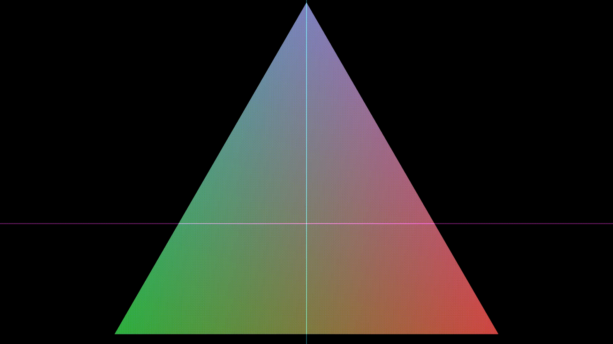
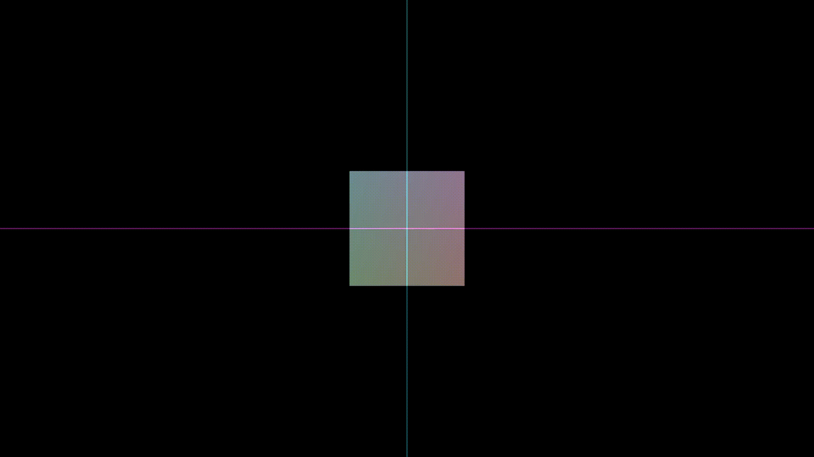
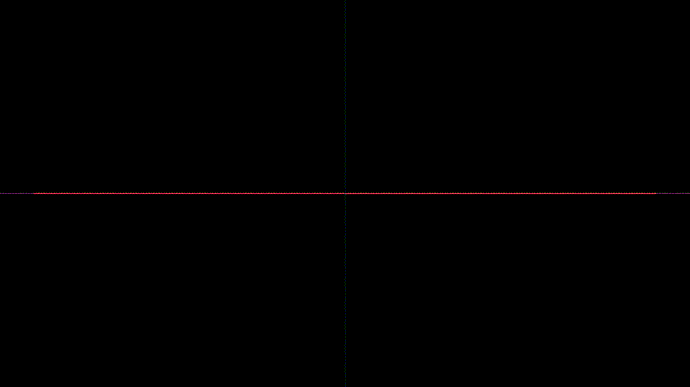
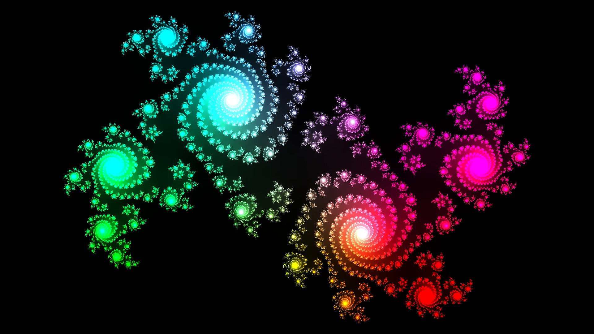
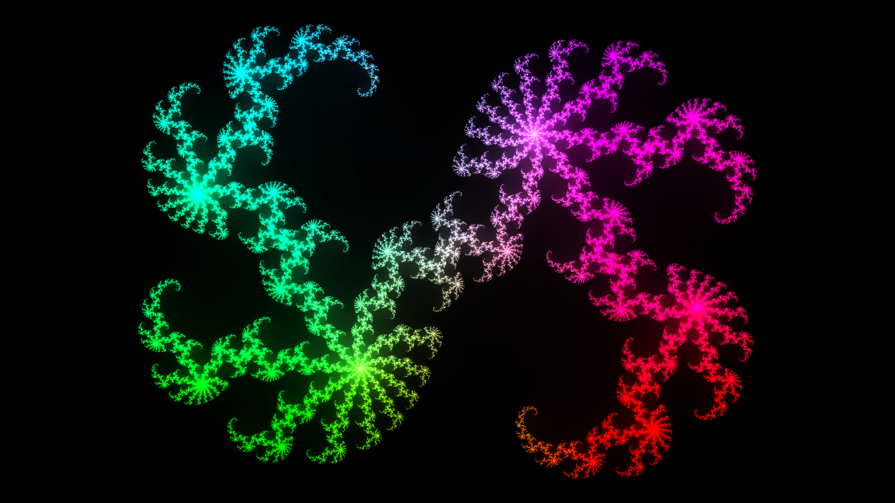
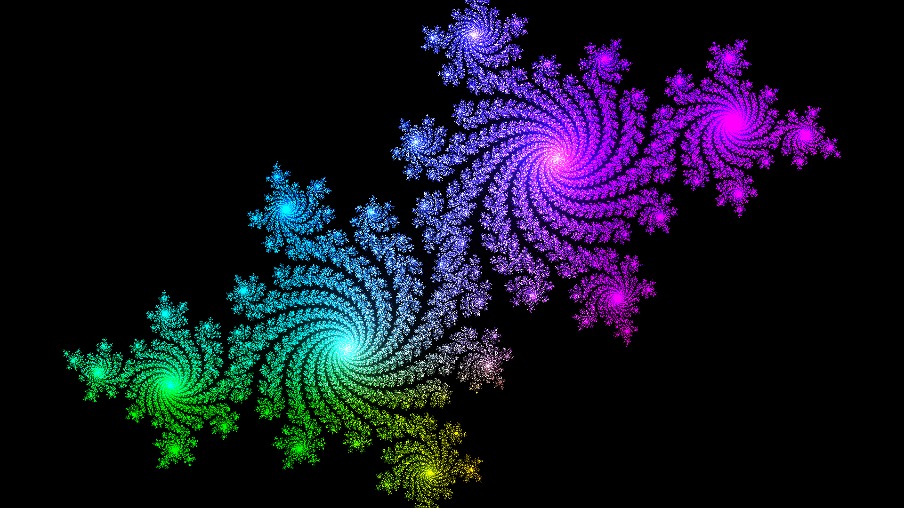

# GLSL fractal-like structures built with maths

[](https://forthebadge.com)
[](https://forthebadge.com)

A repository containing various GLSL Shaders that render 2D and 3D fractals.

Versão em PT-BR 🇧🇷 desse documento: [clique aqui](./README.pt-br.md)

- [How to compile](#how-to-compile)
- [2D Fractals](#2d-fractals)
  - [Sierpinski Triangle](#sierpinski-triangle)
  - [Sierpinski Carpet](#sierpinski-carpet)
  - [Koch Curve](#koch-curve)
  - [Mandelbrot Set](#mandelbrot-set)
  - [Julia Set](#julia-set)
- [3D Fractals](#3d-fractals)
  - [Sierpinski Tetrahedron](#sierpinski-tetrahedron)
  - [Menger Sponge](#menger-sponge)
  - [Menger Brocolli](#menger-brocolli)
  - [Menger Mushroom](#menger-mushroom)
  - [Mandelbulb](#mandelbulb)
  - [Mandelbox](#mandelbox)

## How to compile

📌 In order to compile any of the `.glsl` files in this repository, you can follow these steps:
1. Go to the [ShaderToy](https://www.shadertoy.com/new) website.
2. You will be presented with a screen and an input-box to write code. Choose the GLSL shader you want to compile. Copy and paste the entire code from the file to ShaderToy.
3. Click ALT + ENTER to compile, and the fractal should start rendering on the screen.

Feel free to mess with the values and see what changes!

Direct links to each fractal will be added shortly.

## 2D Fractals

### Sierpinski Triangle



📌 This fractal was first described by Polish mathematician Waclaw Sierpinski in 1915, even before the term "fractal" was first used. This is probably one of the best known fractals.

➕ It has fractal (Hausdorff) dimension of:


🎨 To construct the Sierpinski Triangle you can follow these steps:
1. Start with a triangle on a plane (canonically, an equilateral triangle was used, but any sort of triangle will do just fine).
2. Shrink the triangle until it's sides are half the original size and make three copies of the small version, placing them so that each one touches the others on one vertex.
3. Repeat step 2 for each new figure infinite times and you'll have the fractal!

The first iteration of this loop gives you a level-1 triangle, the second one gives you a level-2 triangle, and so on. The Sierpinski Triangle is the resulting shape after infinite iterations.

### Sierpinski Carpet



📌 This fractal was described by the same Waclaw Sierpinski, who developed the Sierpinski Traingle. This one is a lesser known creation from the mathematician.\
It is a two-dimensional generalization of the one-dimensional Cantor Set.

➕ It has fractal (Hausdorff) dimension of:


🎨 To construct the Sierpinski Carpet you can follow these steps:
1. Start with a square on a plane.
2. Subdivide it in 9 equal parts and remove the central square so that you are left with 8 squares.
3. Repeat step 2 infinite times for all remaining squares and you'll have the fractal!

The first iteration of this loop gives you a level-1 carpet, the second one gives you a level-2 carpet, and so on. The Sierpinski Carpet is the resulting shape after infinite iterations.

### Koch Curve



📌 This fractal was first demonstrated in a 1904 paper titled "On a Continuous Curve Without Tangents, Constructible from Elementary Geometry", by the Swedish mathematician Helge Von Koch.

➕ It has fractal (Hausdorff) dimension of:


🎨 To construct the Koch Curve you can follow these steps:
1. Start with either a line segment or an equilateral triangle. Now, repeat the next steps recursively for each line segment you draw.
2. Divide the line segment into three equal-sized line segments.
3. Use the middle segment as the base for an equilateral triangle that points outward (if you started with a triangle; otherwise, just choose one direction to be "outward").
4. Remove the line segment used as the base for the triangle.
5. Repeat steps 2 to 4 infinite times for each individual line segment and you'll have the fractal!

The first iteration of this loop gives you a level-1 curve, the second one gives you a level-2 curve, and so on. The Koch Curve is the resulting shape after infinite iterations.

### Mandelbrot Set


📌 This fractal is defined as a set of numbers c in the complex plane that obey a certain rule. It's one the most famous fractals to date. It was first investigated in the early 20<sup>th</sup> century by the French mathematicians Pierre Fatou and Gaston Julia.\
It was then defined and drawn by Robert W. Brooks and Peter Matelski in 1978, as a part of a study about Kleinian groups.\
However, it's name comes from the person who first plotted a visualization of the set on a computer, Benoit Mandelbrot, on March 1<sup>st</sup> 1980, at IBM's (International Buisiness Machines Corporation) research division. He also studied several other topics regarding fractal geometry.\
Formal mathematical studies of the Mandelbrot set only began in 1985, with the works of mathematicians Adrien Douady and John H. Hubbard, who established many of its fundamental properties, and finally named the fractal in honor of Benoit Mandelbrot's influential works in fractal geometry.

➕ It has fractal (Hausdorff) dimension of:


🎨 The easiest way to create a visualization of the Mandelbrot set is to plot it on a computer, using per-pixel operations. To do so, you can convert a complex number, , to pixel coordinates on an image, where a is the X position of the pixel and b is the Y position of the pixel.\
A complex c belongs to the Mandelbrot set if the function:


does not diverge with z starting at 0 when under infinite recursion.\
By applying this recursion to every complex number that corresponds to each pixel on an image, and coloring it based on the number of iterations it takes to diverge, you can get an image similar to the one shown on the gif.\
All pixel coordinates should be normalized to not exceed |2| on any axis, since the entirety of the Mandelbrot set is contained inside a circle of radius 2.

### Julia Set





📌 Let:


where z and c are numbers on the complex plane. The Julia set can then be defined as the set of complex numbers z that under infinite iteration by f<sub>c</sub> do not diverge.\
c can be any complex number, as long as it does not change during recursion. For each different c there is a different set o z's that follow the described rule.\
The set is named after the French mathematician Gaston Julia

➕ It has fractal (Hausdorff) dimension of:


🎨 The Julia set can't be plotted as one single image, due to the infinite possible values of c. Because of that, you must first choose a value of c you want to plot for.\
The rest of the process is essentialy the same as the one used to plot the Mandelbrot set: by transforming complex numbers to pixel coordinates, you can iterate f<sub>c</sub> for each complex number corresponding to each pixel on the image and color it based on the number of iterations it takes to diverge.\
Pixel coordinates to plot the Julia fractals should also be normalized to no exceed |2| on any axis, just like with the Mandelbrot set.\
By changing the complex c chosen, you can get different images. Interestingly, if c ∈ Mandelbrot set, the corresponding Julia fractal will be one solid shape (refer to screenshot 2), and if c ∉ Mandelbrot set, the corresponding Julia fractal will not be just one solid shape, but a collection of disjointed shapes (refer to screenshot 1).

## 3D Fractals

### Sierpinski Tetrahedron


📌 This fractal is the 3-dimensional analogue to the Sierpinski Triangle. It is also known as the Tetrix.

➕ It has fractal (Hausdorff) dimension of:


🎨 The construction process for a Tetrix is very similar to that of the Sierpinski Triangle:
1. Start with a tetrahedron of side-length L.
2. Shrink it to half its original height.
3. Put together four copies of the half-height tetrahedron, so that each of them touch each other in one vertex.
4. Repeat steps 2 and 3 for the new shapes each iteration.

The first iteration of this loop will give you a level-1 tetrahedron, the second one will give you a level-2 tetrahedron, and so on. The Sierpinski Tetrahedron itself is the resulting shape after infinite iterations.

A similar fractal can be constructed using a square-based pyramid as its base.

### Menger Sponge


📌 This fractal is a three-dimensional generalization of the two-dimensional Sierpinski Carpet, and, likewise, also a generalization of the one-dimensional Cantor Set. It was first described by Karl Menger in 1925, during his studies of topological dimnesnions.

➕ It has fractal (Hausdorff) dimension of:


🎨 You can construct the Menger Sponge with the following steps:
1. Start with a cube.
2. Subdivide each face of the cube in 9 equal sized suqares, like in a Rubik's Cube. This will subdivide the cube in 27 smaller cubes.
3. Remove the smaller cubes on the center of each face, and the smaller cube on the very center of the larger cube (leaving a total of 20 cubes).
4. Now, repeat steps 2 and 3 for each smaller cube infinite times an you have the fractal!

The first iteration of this loop gives you a level-1 sponge, the second one gives you a level-2 sponge, and so on. The Menger Sponge itself is the resulting shape after infinite iterations.

### Menger Brocolli


📌 This is not a canonical fractal. It was constructed by me while I played with the algorithm I used to render the Menger Sponge and it is not based on any canonical fractal. I named it Menger Brocolli due to the fact that it uses the same algorithm I used for the Menger Sponge, and it also resembles a coliflower or a brocolli.\
Unfortunately, the original algorithm I used to make that animaiton was lost, and the one provided on this repository is a mere aproximation (I couldn't find the original paramenters I used to make it like in the video).

🎨 The construction of this fractal will be explained based on the algorithm used, since there is no canonical definition to its shape. It was constructed using a ray-marched Signed Distance Field (SDF) and several other space-altering functinos provided on the shader.\
For all of the three-dimensional fractals, the resources I used were:
- [Inigo Quilez](http://iquilezles.org)​
- [Sebastian Lague](https://www.youtube.com/user/Cercopithecan)
- [Code Parade](https://www.youtube.com/channel/UCrv269YwJzuZL3dH5PCgxUw)

### Menger Mushroom


📌 Like the Menger Brocolli, I constructed this one myself, also based on the same algortihm I used to render the Menger Sponge. In fact, it isn't even one sigle fractal, but a collection of several fractal shapes merging together to form the animation. I named it Menger Mushroom also because I used the algorithm from the Menger Sponge as a base, and, for some reason, it reminded me of mushrooms, so I went with it.\
Unlike the brocolli, the shader on this repository is the original shader I used to record the animation.

🎨 The construction of this fractal will be explained based on the algorithm used, since there is no canonical definition to its shape. It was constructed using a ray-marched Signed Distance Field (SDF) and several other space-altering functinos provided on the shader.\
For all of the three-dimensional fractals, the resources I used were:
- [Inigo Quilez](http://iquilezles.org)​
- [Sebastian Lague](https://www.youtube.com/user/Cercopithecan)
- [Code Parade](https://www.youtube.com/channel/UCrv269YwJzuZL3dH5PCgxUw)

### Mandelbulb


📌 This fractal was first constructed by Daniel White and Paul Nylander in 2009, using spherical coordinates. It is not, however, a canonical three-dimensional Mandelbrot set. Such structure does not exist, since there is no three-dimensional analogue to the two-dimensional complex set of numbers. It is possible to construct a canonical Mandelbrot Set in four dimensions using quaternions and bicomplex numbers, but the Mandelbulb is different to that.

➕ It has fractal (Hausdorff) dimension of:


This is, however, only been conjectured, and has not been proven as of the creation of this repository.

🎨 The Mandelbulb is defined as the set o points c in  ℝ<sup>3</sup> that, under the iteratoin of the function:


with v starting at (0, 0, 0) does not diverge.\
The n<sup>th</sup> power of the vector v = (x, y, z) in ℝ<sup>3</sup> is defined as:


Where:

\
\


The Mandelbulb shown on the video is one constructed with n = 8. Different values of n result in different structures. The flow effect on the video is a result of variying the spherical coordinates of each point continuously.\
Probably the most common way of constructing this fractal is by using thechniques such as ray-tracing or ray-marching (as used on the shader for this fractal).

### Mandelbox


📌 A Mandelbox is not a specific fractal, unlike most of the ones covered so far. It can take many forms, but, generaly, can be described as fractal with a boxlike shape, and it was first found by Tom Lowe in 2010.\
It is similar to the Mandelbrot set in the same way the Mandelbulb is similar to it: it is defined as a set of values of a parameter such that the origin (in ℝ<sup>3</sup>, (0, 0, 0)) does not diverge under inifinite iteration of a certain geometrical transformation. It can can also be defined as a map of continuous Julia sets, but can be generalized to any dimension, unlike the Mandelbrot set.

🎨 The Mandelbox is defined as a set of points in space that do not diverge under the following iteration:
```python
function iterate(z):
  foreach component in z:
    if component > 1:
      component = 2 - component
    else if component < -1:
      component = -2 - component

  if |z| < 0.5:
    z = z * 4
  else if |z| < 1:
    z = z / (|z|^2)

  z = scale * z + c
```
In this case c is the point beeing tested, and "scale" is a real constant that can be chosen in the start of the iterative process to change te form of the fractal.

---

These are all of the fractals present in this repository. Thanks goes to all resources cited both in this document and on the shaders specific documentations. And also, thank you for reading!
